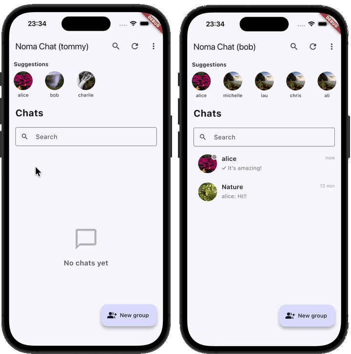
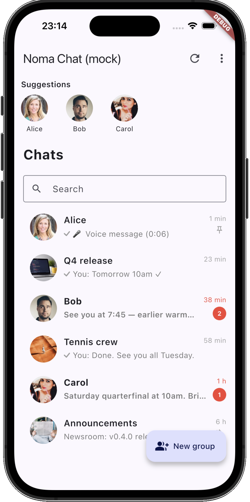
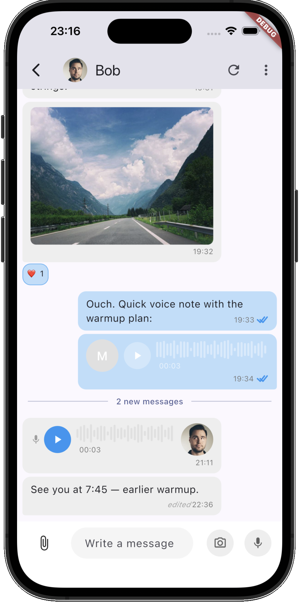
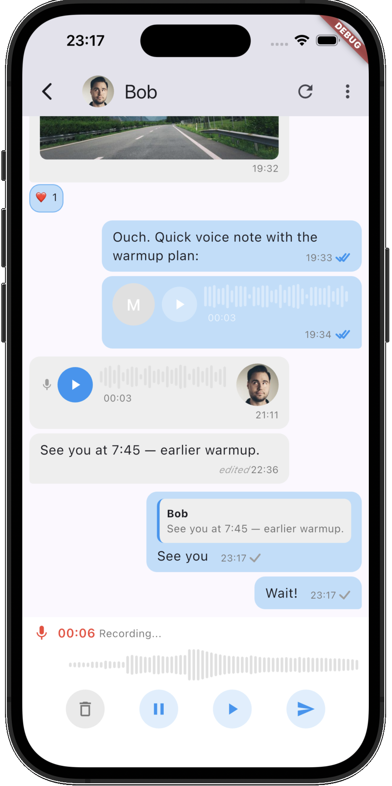
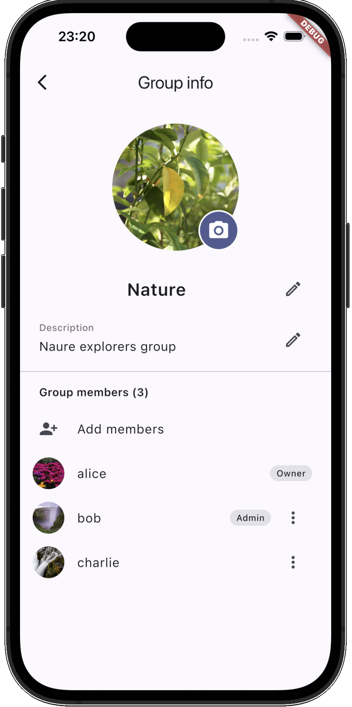

# noma_chat

[](https://pub.dev/packages/noma_chat)
[](https://github.com/nomasystems/noma_chat_flutter/actions/workflows/ci.yml)
[](https://codecov.io/gh/nomasystems/noma_chat_flutter)
[](./LICENSE)

Full-featured Flutter chat in one dependency. Drop it in, wire five lines, ship.

<p align="center">
  
</p>

---

## What you get

| Layer | What's included |
|---|---|
| **SDK** | REST client · WebSocket / SSE / polling with auto-failover · auth · retry · circuit breaker · offline queue |
| **Cache** | Persistent Hive CE storage — messages, rooms and receipts survive cold restarts |
| **UI components** | 30+ production-ready widgets: bubbles, voice messages, reactions, mentions, threads, group flows, search |

---

## Quick start

```yaml
# pubspec.yaml
dependencies:
  noma_chat: ^0.9.0
```

```dart
import 'package:noma_chat/noma_chat.dart';

final chat = await NomaChat.create(
  baseUrl: 'https://chat.myapp.com/v1',
  realtimeUrl: 'https://chat.myapp.com',
  tokenProvider: () => authService.getToken(),
  currentUser: ChatUser(id: userId, displayName: name),
);
await chat.connect();
```

Drop the UI into your widget tree:

```dart
// Full chat screen
ChatView(controller: ChatController(chat: chat, roomId: roomId))

// Room list
RoomListView(controller: RoomListController(chat: chat))
```

---

## Screenshots

<p align="center">
  
  &nbsp;&nbsp;
  
  &nbsp;&nbsp;
  
  &nbsp;&nbsp;
  
</p>

---

## Features at a glance

**SDK**
- Real-time: WebSocket → SSE → polling, automatic failover between transports
- Circuit breaker + exponential backoff + offline message queue
- Token rotation without reconnecting
- 8 sub-APIs: auth, users, rooms, members, messages, contacts, presence, attachments

**UI components — messages**
- Text, image, audio, video, file and link-preview bubbles
- Voice recording with lock-to-record gesture
- Emoji reactions + reaction picker
- @mentions with autocomplete overlay
- Threaded replies
- Per-user read receipts (DM any-read → blue; group all-read → blue)
- Typing indicators
- Forward to multiple rooms
- Pinned messages banner
- Message search

**UI components — rooms & people**
- Room list with unread badges, mute, pin and hide
- WhatsApp-style DM flow (lazy room creation before first message)
- Block / unblock (blocker syncs list; blocked user is never notified)
- Group creation, name + avatar edit, member add / remove / promote
- Profile and avatar management with built-in crop flow
- Media gallery page
- Quick replies bar
- Invitation accept / reject callbacks

**Theme & l10n**
- `ChatTheme` with 155+ fields
- `ChatTheme.branded(accent:)` — derives ~12 accent slots from one colour
- Light / dark presets, high-contrast WCAG-AAA mode
- 7 locales out of the box: `en`, `es`, `fr`, `de`, `it`, `pt`, `ca`

---

## Theming

One line to match your brand:

```dart
theme: ChatTheme.branded(
  accent: Colors.indigo,
  contrastingOnAccent: Colors.white,
)
```

Or full control:

```dart
theme: ChatTheme(
  bubble: ChatBubbleTheme(outgoingColor: Color(0xFF4F46E5)),
  input: ChatInputTheme(backgroundColor: Colors.white),
  roomList: ChatRoomListTheme(unreadBadgeColor: Color(0xFF4F46E5)),
)
```

See [Developer Guide — Theming](./doc/DEVELOPER_GUIDE.md#theming) for all 155+ fields.

---

## Platform support

| Platform | Status | Notes |
|---|---|---|
| Android | **Production** | Primary target. Chat, attachments, voice, presence, offline cache exercised end-to-end. |
| iOS | **Production** | Primary target. Same as Android. |
| macOS / Linux / Windows | Best effort | SDK and UI components work; voice uses platform audio backends. Not exercised in production. |
| Web | Limited | SDK, cache (IndexedDB) and audio playback work. Voice **recording** is disabled (filesystem staging). |

---

## Backend

`noma_chat` is built to talk to a **Nomasystems chat backend**. That backend exposes a REST + WebSocket/SSE API described by a public **OpenAPI 3.0 contract** — [browse the rendered API reference](https://redocly.github.io/redoc/?url=https://raw.githubusercontent.com/nomasystems/noma_chat_flutter/main/doc/user-openapi.yml) or read the [source spec](https://github.com/nomasystems/noma_chat_flutter/blob/main/doc/user-openapi.yml). The SDK speaks exactly that contract, so it runs against **any** backend that implements the spec — not only ours.

The Nomasystems chat backend is **planned to be open-sourced, but is not public yet**. To use it as part of a commercial product, get in touch: **[info@nomasystems.com](mailto:info@nomasystems.com)**.

- Integration guide (endpoints, auth, WS frames): [INTEGRATION.md](./INTEGRATION.md)
- Nomasystems: [www.nomasystems.com](https://www.nomasystems.com/)

---

## Documentation

| Document | Contents |
|---|---|
| [Developer Guide](./doc/DEVELOPER_GUIDE.md) | Architecture · all APIs · configuration · theming · customization · events · testing |
| [ARCHITECTURE.md](./ARCHITECTURE.md) | Internal layers and data-flow diagrams |
| [INTEGRATION.md](./INTEGRATION.md) | Backend contract (endpoints, auth, WS frames, S2S) |
| [Backend API reference](https://redocly.github.io/redoc/?url=https://raw.githubusercontent.com/nomasystems/noma_chat_flutter/main/doc/user-openapi.yml) | Rendered OpenAPI 3.0.1 (Redoc) · [source spec](https://github.com/nomasystems/noma_chat_flutter/blob/main/doc/user-openapi.yml) |
| [MIGRATING.md](./MIGRATING.md) | Step-by-step upgrade guide for every breaking release |
| [CHANGELOG.md](./CHANGELOG.md) | Version history |

---

## When NOT to use

- **Custom backend with incompatible wire protocol** — the SDK speaks the [Nomasystems chat API contract](https://github.com/nomasystems/noma_chat_flutter/blob/main/doc/user-openapi.yml) (REST + WS/SSE, JWT, specific error codes). Any backend that implements that OpenAPI spec works out of the box; for anything else you can plug a custom `ChatClient` via `NomaChat.fromClient()`, but adapting the full contract is non-trivial. Consider whether it fits before adopting.
- **End-to-end encryption** — TLS only. If E2EE is a hard requirement, use a different SDK.
- **Hard latency SLO under ~100 ms** — the SDK is push-based but does not advertise a real-time SLO. For voice / video signalling, use a dedicated SDK.

---

## Troubleshooting

Common issues and fixes are documented in the [Developer Guide — Troubleshooting](./doc/DEVELOPER_GUIDE.md#troubleshooting) section.

---

## Links

- Nomasystems: [www.nomasystems.com](https://www.nomasystems.com/)
- Source: [github.com/nomasystems/noma_chat_flutter](https://github.com/nomasystems/noma_chat_flutter)
- Issues: [github.com/nomasystems/noma_chat_flutter/issues](https://github.com/nomasystems/noma_chat_flutter/issues)
- License: [Apache-2.0](./LICENSE)
