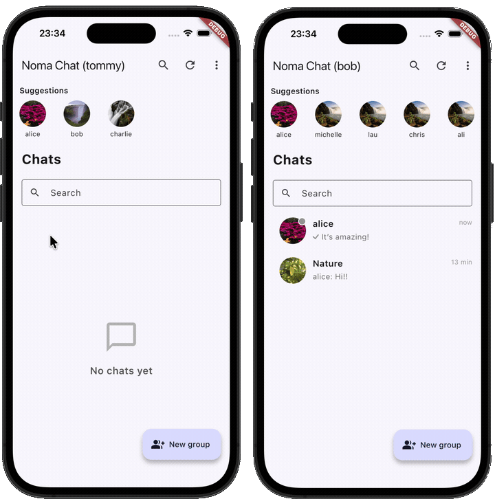
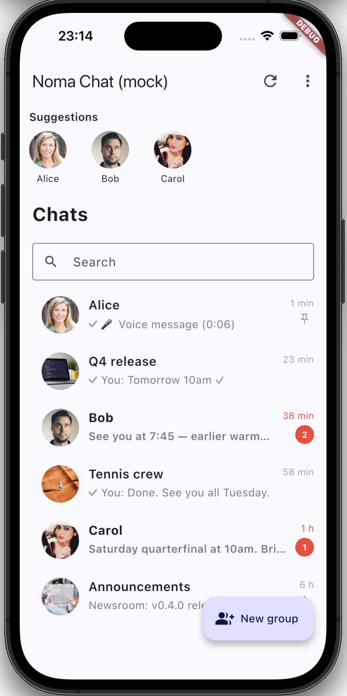
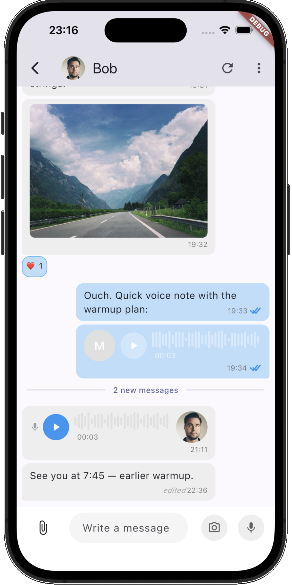
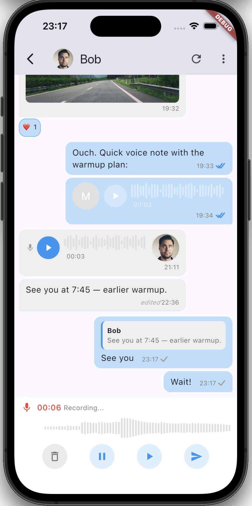
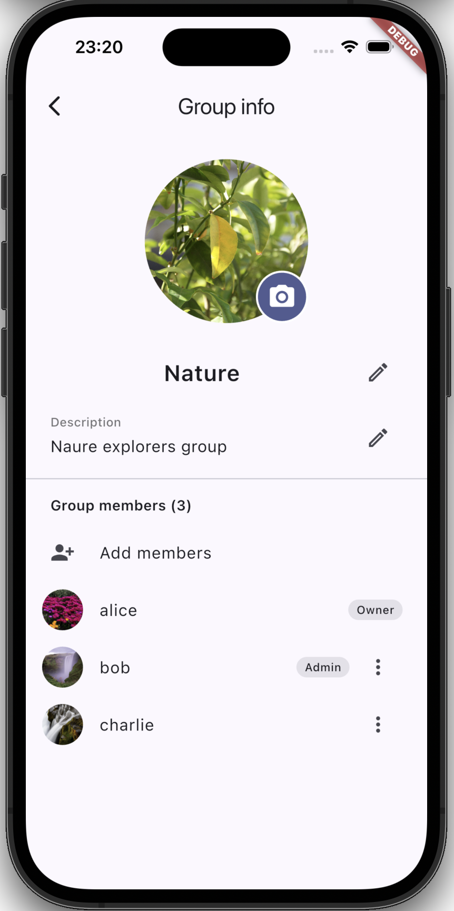

# noma_chat

[](https://pub.dev/packages/noma_chat)
[](https://github.com/nomasystems/noma_chat_flutter/actions/workflows/ci.yml)
[](https://codecov.io/gh/nomasystems/noma_chat_flutter)
[](./LICENSE)

Full-featured Flutter chat in one dependency. Drop it in, wire five lines, ship.

<p align="center">
  
</p>

---

## What you get

| Layer | What's included |
|---|---|
| **SDK** | REST client · WebSocket / SSE / polling with auto-failover · auth · retry · circuit breaker · offline queue |
| **Cache** | Persistent Hive CE storage — messages, rooms and receipts survive cold restarts |
| **UI components** | 30+ production-ready widgets: bubbles, voice messages, reactions, mentions, threads, group flows, search |

---

## Quick start

```yaml
# pubspec.yaml
dependencies:
  noma_chat: ^0.26.0
  # The default persistent cache is Hive-backed; you initialise it (see below).
  hive_ce_flutter: ^2.3.4
```

```dart
import 'package:flutter/widgets.dart';
import 'package:hive_ce_flutter/hive_flutter.dart';
import 'package:noma_chat/noma_chat.dart';

Future<void> main() async {
  // Required before NomaChat.create: the SDK's default Hive cache opens its
  // boxes immediately, so Hive must be initialised first. Skip this only if
  // you disable the cache (`enableCache: false`) or supply your own
  // `localDatasource`.
  WidgetsFlutterBinding.ensureInitialized();
  await Hive.initFlutter();

  final chat = await NomaChat.create(
    baseUrl: 'https://chat.myapp.com/v1',
    realtimeUrl: 'https://chat.myapp.com',
    tokenProvider: () => authService.getToken(),
    currentUser: ChatUser(id: userId, displayName: name),
  );
  await chat.connect();

  runApp(MyApp(chat: chat));
}
```

> Cache disabled? If you pass `enableCache: false` (or your own
> `localDatasource`), you don't need `hive_ce_flutter` or `Hive.initFlutter()`.

Drop the UI into your widget tree:

```dart
// Full chat-room screen — app bar + message list + every room behavior
// (history & pin load, unread divider, group member hydration, blocked /
// room-removed reactions, role-aware context menu, report dialog) auto-wired.
NomaChatView(
  roomId: roomId,
  adapter: chat.adapter,
  onRoomLeft: () => Navigator.of(context).maybePop(),
)

// Room list — the SDK owns the controller; pass currentUserId so the
// own-message ticks and the "You:" group prefix render correctly.
RoomListView(
  controller: chat.roomListController,
  currentUserId: userId,
)
```

`NomaChatView` is the recommended way to render a room. For a fully custom
screen, compose `ChatView` (with your own `ChatController`, app bar and
callbacks) by hand instead — see the [Developer Guide](./doc/DEVELOPER_GUIDE.md#nomachatview).

---

## Screenshots

<p align="center">
  
  &nbsp;&nbsp;
  
  &nbsp;&nbsp;
  
  &nbsp;&nbsp;
  
</p>

---

## Features at a glance

**SDK**
- Real-time: WebSocket → SSE → polling, automatic failover between transports
- Circuit breaker + exponential backoff + offline message queue — the queue
  drains on every connection, including the first one after a cold start;
  inspect it with `pendingOperationCount` and force a drain with
  `flushPendingOperations()`
- The same resilience primitives are exported for your own calls to the
  backend (`computeBackoffMs`, `CircuitBreaker`, `CircuitBreakerRegistry` from
  `package:noma_chat/noma_chat_advanced.dart`)
- Duplicate-submission guard on `rooms.create` / `rooms.updateConfig` /
  `members.invite` / `members.remove` — a double-tap fires one request, not
  two (client-side only; the backend does not honour `Idempotency-Key` yet)
- Dead-peer detection — a pong watchdog forces a reconnect on a "zombie" WS
  a NAT timeout or network handoff left half-open
- SDK-owned app lifecycle — reconnects and resyncs on resume by default
  (`manageAppLifecycle`); opt out to drive it yourself
- Cache-first room list — never flashes empty across a background/reconnect
  cycle; self-heals in the background instead
- Token rotation without reconnecting
- 8 sub-APIs: auth, users, rooms, members, messages, contacts, presence, attachments
- Global or per-room message search — `messages.search(query)` spans every room the user belongs to; `messages.search(query, roomId:)` stays scoped
- Bidirectional opaque-cursor pagination — page back through history and catch up on newer messages
- Stable, localizable error tokens — branch and translate on `ChatFailure.errorToken` (a snake_case code such as `room_not_found` or `rate_limited`), never on an English string
- GDPR self-service deletion — `users.deleteCurrentUser()` erases the authenticated account, token-scoped so it can't target the wrong user

**Security & observability**
- Standard TLS transport — the SDK relies on the operating system's CA trust store to validate server certificates; it does **not** pin certificates
- Optional at-rest cache encryption — hand `NomaChat.create` a Hive AES cipher and the offline message / room store is encrypted on device
- Structured logging pipeline (`ChatLogTag`/`ChatLogLevel`, pluggable `ChatLogSink`s, one-tap file export via `ChatLogExporter`) alongside the classic `logger` callback + `metricCallback` hook — every metric name and when it fires is documented in [TELEMETRY.md](./TELEMETRY.md), and nothing leaves the device unless you wire a sink yourself
- Product-analytics channel (`ChatConfig.analyticsSink` / `ChatUiAdapter`'s constructor) — a separate, opt-in stream of `ChatAnalyticsEvent`s (room opened, message received, voice played, send outcome) that, unlike `metricCallback`, is allowed to carry room/message identifiers; see [ANALYTICS.md](./ANALYTICS.md)

**UI components — messages**
- Text, image, audio, video, file and link-preview bubbles — media bubbles
  re-mint an expired signed download URL automatically and retry once
- Cancellable photo/video/file uploads — a determinate progress ring with an
  X that aborts the transfer mid-flight and removes the provisional bubble,
  wired by default; the retry arrow shows only after a genuine failure
- Retriable failed uploads — the bytes of an upload that failed are held in
  memory (`ChatUiAdapter.failedUploads`, 8 files of up to 12 MB by default),
  so "Retry" re-uploads the same file instead of asking for it again, and
  `messages.discardFailed` removes a send the user gave up on. Both empty
  the offline queue of that row, so a discarded send never delivers late
  and a retried one delivers once. A media send that failed also stops
  being advertised as sent in the chat list
- Confirmed deletion — "Delete" (for everyone, irreversible) asks first;
  "Delete for me" and "Discard" do not. Turn the dialog off with
  `ChatViewBehaviors(confirmDeleteForEveryone: false)`
- Blocked senders are pruned inside groups, not just anonymized —
  `ChatViewBehaviors.blockedContentPolicy` (`placeholder` by default, or
  `hide` / `show`). Bubble, quoted reply, reactions and the room-list
  preview all go, and the room says it is pruning; a 1:1 chat is left alone
  with its existing blocked banner and its whole history
- Screen readers hear what a non-text bubble is ("You: Photo, Sent",
  "You: Location, Sent") and hear a failed send announced as failed
- Built-in camera screen wired by default — tap the shutter for a photo,
  hold it to record a clip, pinch to zoom, flip the lens; every capture then
  lands on a WhatsApp-style review step (send / retake / discard) and only a
  confirmed one is sent, EXIF stripped, without leaving the chat. Override
  the whole flow with `ChatViewCallbacks.onPickCamera`, or push
  `CameraCapturePage.show()` yourself and keep the result
- Attachment picker rejections (too large, wrong type, unreadable) surface
  via `onRejected` instead of a silent drop
- Voice recording with lock-to-record gesture
- Emoji reactions + reaction picker
- @mentions with autocomplete overlay
- Threaded replies
- WhatsApp-style delivery ticks (sending → sent → delivered → read → failed),
  cursor-based and confirmed automatically
- Per-user read receipts (DM any-read → blue; group all-read → blue)
- Typing indicators
- Forward to multiple rooms
- Pinned messages banner
- Message search

**UI components — rooms & people**
- Room list with unread badges, mute, pin and hide
- Deep-link-safe room open (`adapter.rooms.open(roomId)`) — fetches an
  unsynced room (push notification, shared link) with typed failures
  instead of a blind "this chat doesn't exist"
- WhatsApp-style DM flow (lazy room creation before first message)
- Block / unblock (blocker syncs list; blocked user is never notified)
- Group creation, name + avatar edit, member add / remove / promote
- Profile and avatar management with built-in crop flow
- Media gallery page
- Quick replies bar
- Invitation accept / reject callbacks

**Theme & l10n**
- `ChatTheme` with 155+ fields
- `ChatTheme.branded(accent:)` — derives ~12 accent slots from one colour
- Light / dark presets, high-contrast WCAG-AAA mode
- Localized out of the box: `en`, `es`, `fr`, `de`, `it`, `pt`, `ca`, `sv`, `no`, `da`, `pl`, `cs`

**Automation**
- Stable names on the chat room and its eleven internal surfaces — see
  [Test identifiers](#test-identifiers) below

---

## Theming

One line to match your brand:

```dart
theme: ChatTheme.branded(
  accent: Colors.indigo,
  contrastingOnAccent: Colors.white,
)
```

Or full control:

```dart
theme: ChatTheme(
  bubble: ChatBubbleTheme(outgoingColor: Color(0xFF4F46E5)),
  input: ChatInputTheme(backgroundColor: Colors.white),
  roomList: ChatRoomListTheme(unreadBadgeColor: Color(0xFF4F46E5)),
)
```

Even the delivery ticks are replaceable — per state, with SDK fallback:

```dart
bubble: ChatBubbleTheme(
  statusIconBuilder: (context, data) =>
      data.state == MessageDeliveryState.read
      ? Icon(Icons.done_all, size: data.size, color: Colors.teal)
      : null, // SDK default for the other states
)
```

See [Developer Guide — Theming](./doc/DEVELOPER_GUIDE.md#theming) for all 155+ fields.

The short notices the SDK shows on its own (an unblock that failed, a
permission denied, a role change the server refused) are snackbars out of
the box — nothing to mount. Wrap the app to present them your way:

```dart
ChatNoticeScope(
  presenter: (context, message) {
    myBanners.show(message);
    return true; // false leaves this one to the SDK
  },
  child: MaterialApp(/* … */),
)
```

---

## Platform support

| Platform | Status | Notes |
|---|---|---|
| Android | **Production** | Primary target. Chat, attachments, voice, presence, offline cache exercised end-to-end. |
| iOS | **Production** | Primary target. Same as Android. |
| macOS / Linux / Windows | Best effort | SDK and UI components work; voice uses platform audio backends. Not exercised in production. |
| Web | Limited | SDK, cache (IndexedDB) and audio playback work. Voice **recording** is disabled (filesystem staging). |

| Feature | Status | Notes |
|---|---|---|
| In-app camera (`CameraCapturePage`) | **Production** on Android / iOS · Limited elsewhere | Tap the shutter for a photo, hold it to record a clip, then confirm on the review step (full-screen still or playable clip, send / retake / discard); pinch to zoom, flip lens, permission recovery via Settings. On desktop and web the composer's Camera row falls back to `image_picker`'s system camera (stills only) — `PlatformSupport.supportsInAppCameraCapture`. |
| Video poster frames (`VideoThumbnailer`) | **Production** on Android / iOS · Limited elsewhere | Sending a video generates a preview frame and uploads it as a second small blob, so the bubble shows a real still instead of a grey placeholder. The backend never transcodes, so the sender is the only place this can happen. Off on desktop (no plugin implementation) and on web (the extractor needs a file path, which web has no equivalent of, and every attachment URL needs a Bearer token) — `PlatformSupport.supportsVideoThumbnails`. Where it is off, and for videos sent before it existed, the bubble keeps the placeholder + play button. |

### ⚠️ Android: adopting `noma_chat` makes your app camera-required on Google Play

`camera` is a direct dependency of this package, and its Android
implementation (`camera_android_camerax`) ships these lines in its own
manifest, which the merger folds into **your** app:

```xml
<uses-feature android:name="android.hardware.camera.any" />
<uses-permission android:name="android.permission.CAMERA" />
<uses-permission android:name="android.permission.RECORD_AUDIO" />
```

`android:required` defaults to **`true`**, and the two permissions add three
more requirements you never wrote: Google Play *implies* a `<uses-feature>`
from a permission that needs one, so `CAMERA` implies
`android.hardware.camera` **and** `android.hardware.camera.autofocus`, and
`RECORD_AUDIO` implies `android.hardware.microphone` — all four required.
So the moment you add `noma_chat`, Google Play stops offering your app to
every device without a camera, without autofocus or without a microphone —
most Android TV boxes, many Chromebooks, some tablets, kiosk and emulator
device profiles. Nothing warns you: the build succeeds, and the drop only
shows up as a smaller supported-device count in the Play Console.

Chat does not need a camera to work (`CameraCapturePage` is one row of the
attachment sheet; without a camera that row simply fails to open a
viewfinder). Unless you *want* the filter, put **all four** of these in your
app's `android/app/src/main/AndroidManifest.xml`:

```xml
<manifest xmlns:android="http://schemas.android.com/apk/res/android"
    xmlns:tools="http://schemas.android.com/tools">

    <uses-feature
        android:name="android.hardware.camera.any"
        android:required="false"
        tools:replace="android:required" />

    <!-- Implied by the CAMERA / RECORD_AUDIO permissions the plugin merges
         in. Nothing declares these, so they need no tools:replace — but
         without them the filter stays on. -->
    <uses-feature
        android:name="android.hardware.camera"
        android:required="false" />
    <uses-feature
        android:name="android.hardware.camera.autofocus"
        android:required="false" />
    <uses-feature
        android:name="android.hardware.microphone"
        android:required="false" />

    <!-- … the rest of your manifest … -->
</manifest>
```

The first one needs `tools:replace`, the other three must not have it.
`android:required` on `<uses-feature>` is OR-merged, so a plain
`android:required="false"` for `camera.any` loses to the library's explicit
declaration **silently** — no error, no warning; `tools:replace` is what
makes yours win. The other three are never declared by anyone, so an
explicit `false` is all it takes to override the implied requirement, and a
`tools:replace` on them fails the build. Both the `xmlns:tools` declaration
and the placement above are load-bearing. Confirm the outcome in
`app/build/outputs/logs/manifest-merger-*-report.txt`.

---

## Backend

`noma_chat` is built to talk to a **Nomasystems chat backend**. That backend exposes a REST + WebSocket/SSE API described by a public **OpenAPI 3.0 contract** — [browse the rendered API reference](https://redocly.github.io/redoc/?url=https://raw.githubusercontent.com/nomasystems/noma_chat_flutter/main/doc/chat-api-openapi.yml) or read the [source spec](https://github.com/nomasystems/noma_chat_flutter/blob/main/doc/chat-api-openapi.yml). The SDK speaks exactly that contract, so it runs against **any** backend that implements the spec — not only ours.

The Nomasystems chat backend is **planned to be open-sourced, but is not public yet**. To use it as part of a commercial product, get in touch: **[info@nomasystems.com](mailto:info@nomasystems.com)**.

- Integration guide (endpoints, auth, WS frames): [INTEGRATION.md](./INTEGRATION.md)
- Nomasystems: [www.nomasystems.com](https://www.nomasystems.com/)

---

## Documentation

| Document | Contents |
|---|---|
| [Developer Guide](./doc/DEVELOPER_GUIDE.md) | Architecture · all APIs · configuration · theming · customization · events · testing |
| [ARCHITECTURE.md](./ARCHITECTURE.md) | Internal layers and data-flow diagrams |
| [INTEGRATION.md](./INTEGRATION.md) | Backend contract (endpoints, auth, WS frames, S2S) |
| [Backend API reference](https://redocly.github.io/redoc/?url=https://raw.githubusercontent.com/nomasystems/noma_chat_flutter/main/doc/chat-api-openapi.yml) | Rendered OpenAPI 3.0.1 (Redoc) · [source spec](https://github.com/nomasystems/noma_chat_flutter/blob/main/doc/chat-api-openapi.yml) |
| [SECURITY.md](./SECURITY.md) | Threat model · what the SDK does and does not guarantee · consumer hardening checklist |
| [TELEMETRY.md](./TELEMETRY.md) | SDK observability metrics (`metricCallback`) — every metric name, fields, and when it fires |
| [ANALYTICS.md](./ANALYTICS.md) | Product-analytics events (`analyticsSink`) — separate from telemetry, carries room/message identifiers |
| [MIGRATING.md](./MIGRATING.md) | Step-by-step upgrade guide for every breaking release |
| [CHANGELOG.md](./CHANGELOG.md) | Version history |

---

## When NOT to use

- **Custom backend with incompatible wire protocol** — the SDK speaks the [Nomasystems chat API contract](https://github.com/nomasystems/noma_chat_flutter/blob/main/doc/chat-api-openapi.yml) (REST + WS/SSE, JWT, specific error codes). Any backend that implements that OpenAPI spec works out of the box; for anything else you can plug a custom `ChatClient` via `NomaChat.fromClient()`, but adapting the full contract is non-trivial. Consider whether it fits before adopting.
- **End-to-end encryption** — TLS in transit, with optional at-rest encryption of the on-device cache, but messages are **not** end-to-end encrypted. If E2EE is a hard requirement, use a different SDK.
- **Hard latency SLO under ~100 ms** — the SDK is push-based but does not advertise a real-time SLO. For voice / video signalling, use a dedicated SDK.

---

## Troubleshooting

Common issues and fixes are documented in the [Developer Guide — Troubleshooting](./doc/DEVELOPER_GUIDE.md#troubleshooting) section.

## Test identifiers

Every actionable control, observable state and collection row the SDK paints
carries a stable name, published **twice with the same literal**: as the
widget's `ValueKey` — what `find.byKey` and an `integration_test` see from
inside the app — and as `Semantics(identifier:)`, which surfaces outside it as
`resource-id` on Android and `accessibilityIdentifier` on iOS. The same string
drives a widget test, a UiAutomator dump and an XCUITest run.

Names read `<area>_<element>_<kind>` in lower snake case under a `chat_` prefix
(`chat_message_input`, `chat_send_button`, `chat_gallery_media_tab`,
`chat_camera_review_send`); collection rows carry their own id
(`chat_message_<messageId>_outgoing`, `chat_starred_item_<messageId>`). For the
templated ones, ask the SDK instead of re-deriving the format —
`messageBubbleSemanticsId`, `messageStatusSemanticsId`, `attachmentSemanticsId`,
`mediaCellSemanticsId`, `docRowSemanticsId`, `linkRowSemanticsId`,
`searchResultSemanticsId`, `starredRowSemanticsId` and
`starredUnstarSemanticsId` are exported.

A message row states **who wrote it** in its own name: the bubble answers to
`chat_message_<messageId>_outgoing` when the current user sent it and to
`chat_message_<messageId>_incoming` otherwise, so a driver reads authorship off
the tree instead of inferring it from the bubble colour or from which side of
the room it sits on. Its delivery tick is named separately,
`chat_message_<messageId>_status`, and carries the `sent` / `delivered` / `read`
rendering of that one message.

`AttachmentSheetOption.identifier` names a row of the attachment sheet, so a
driver points at an option regardless of the locale its `label` renders in. A
row in `extraOptions` that passes nothing falls back to
`chat_attachment_option_extra_<position>`, stable only while the list keeps its
order.

Three caveats. Turning the semantics tree on is **your** call
(`WidgetsBinding.instance.ensureSemantics()` under a test flavour, or the
platform's own accessibility service) — without it the `Semantics` half is
invisible to a native driver, while the `ValueKey` half works regardless.
Surfaces you own are yours to name: the `AppBar` around `MessageSearchView` and
`StarredMessagesView`, and any attachment sheet injected in place of the SDK's.
And `chat_message_<messageId>_status` does not reach an iOS dump from inside a
bubble. A bubble consolidates the announcements of everything it contains into
a single screen-reader label and excludes its own subtree, so there the
`ValueKey` stays on the tick while the identifier rides a bare sibling node —
name only, no label, value, hint or action. On iOS that node is not published:
`SemanticsObject.isAccessibilityElement` defers to `isFocusable`, which asks
for a label, a value, a hint or a non-scrolling action and never looks at the
identifier, so XCUITest and `idb` do not list it. Inside a bubble the tick's
name is therefore reachable by `ValueKey` (widget tests, `integration_test`,
the VM Service) and as `resource-id` on Android, and **not** from an iOS dump —
where the delivery state is instead readable from the bubble's own label, which
ends in it, localised. Rendered standalone the tick keeps both halves on itself
and is published normally: its own label makes it focusable.

The full convention lives in [`CONVENTIONS.md` §10.11](./CONVENTIONS.md).

## Development

- Tests: `flutter test -x golden`. Golden (snapshot) tests run on CI/Linux as the
  source of truth — see [`test/golden/README.md`](test/golden/README.md).
- Regenerate golden baselines after a UI change, without a Linux machine:
  `tool/regen_goldens.sh` (drives the `regen-goldens` workflow and pulls the PNGs).

---

## Links

- Nomasystems: [www.nomasystems.com](https://www.nomasystems.com/)
- Source: [github.com/nomasystems/noma_chat_flutter](https://github.com/nomasystems/noma_chat_flutter)
- Issues: [github.com/nomasystems/noma_chat_flutter/issues](https://github.com/nomasystems/noma_chat_flutter/issues)
- License: [Apache-2.0](./LICENSE)
